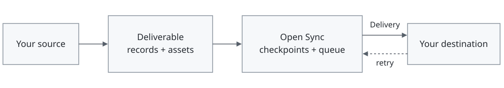

<div align="center">
  <h1> Open Sync</h1>
  <p><em>Data sync from any source to any destination.</em></p>
  
  <br /><br />

[](https://app.nibrun.com/deploy?name=open-sync&binary=https%3A%2F%2Fgithub.com%2Fmassimoalbarello%2Fopen-sync%2Freleases%2Fdownload%2Fnibrun-latest%2Fopen-sync&port=3000&minimal)

</div>

Open Sync is a headless sync engine that handles checkpointing, queuing, and retries. You define
how sources read data and how destinations deliver it, so the same engine can fit different
providers, storage systems, and workflows.

Embed it as a dependency and call it directly from your host's business logic. The engine runs
in the same process; your application keeps its own UI and authentication.

This repository also includes a default host implementation as a sample app: a dashboard with
sources for GitHub pull requests, Gmail and Slack threads, and Granola meetings.

## How it works



| Concept | What it is | How to configure it |
| --- | --- | --- |
| **Source** | Code that reads data and produces records and assets as a deliverable. | Register it in `definitions`; declare inputs in `configSchema` and read data in `step()`. |
| **Record** | A structured item, such as an email thread. | Set `operation` (`upsert` or `delete`), `kind`, and a stable `id`. Upserts include `data` matching the source's `kinds` schema. |
| **Asset** | Binary content, such as an attachment or image. | Capture it with `assets.capture()` and include its reference in a record's `assetRefs` or the deliverable's `assets`. |
| **Deliverable** | A batch of records and optional assets produced by a source. | Return it from `step()` alongside a `checkpoint` (where to resume) and `complete` (whether this poll finished). |
| **Engine** | Coordinates polling, saves checkpoints, queues deliveries, and retries failed work. | Set up `createOpenSync()` with your `definitions`, `destinationTypes`, and `dataDirectory`. Your host controls its `start()` and `close()` lifecycle. |
| **Delivery** | A queued message sent to a destination, with an ID that stays the same on retries. | Open Sync creates it automatically; your delivery logic receives it in `deliver()`. |
| **Destination** | Where your delivery logic stores or forwards the data. | Register its delivery handler in `destinationTypes` with a `configSchema` and `deliver()`. Set `acceptsAssets: true` to receive assets. |

Your delivery logic must handle retries safely and return `{ status: 'accepted' }` only after saving
the whole delivery.

## Embed in your host

The current package requires Bun 1.4+.

```sh
bun add @context-use/open-sync
```

1. Call `await createOpenSync()` with a data directory, your sources and destinations,
   and your host's authorization functions.
2. Route requests to `sync.fetch(request)` and set `publicUrl` to that route's full URL
   (for example, `https://your-app.com/api/open-sync`). This also handles provider authorization callbacks.
3. Call `sync.start()` when your server starts and `await sync.close()` when it shuts down.

Use `sync.providers` to connect accounts. Create a destination with `sync.api.createDestination()`,
then link a source to it with `sync.api.createInstallation()`. Supply their `config` values,
a provider `connection` when needed, and `intervalMs` for the sync schedule. Pass the acting user's
`actorId` and data owner's `ownerId` from your host's authentication.

See the [sample host](apps/web/backend/src/main.ts),
[configuration options](packages/sync/src/open-sync.ts), and
[source and destination examples](examples/integrations/src).

## Deploy on nibrun

[](https://app.nibrun.com/deploy?name=open-sync&binary=https%3A%2F%2Fgithub.com%2Fmassimoalbarello%2Fopen-sync%2Freleases%2Fdownload%2Fnibrun-latest%2Fopen-sync&port=3000&minimal)

Use the button above to deploy the sample host on nibrun. Open your instance's URL,
create an account, and connect your providers.

To update an existing instance, complete the local setup below, then install the nibrun CLI and sign in:

```sh
curl -fsSL https://nibrun.com/install.sh | sh
nib login
bun run deploy --app YOUR_APP_SLUG
```

Replace `YOUR_APP_SLUG` with the slug from `nib apps list`. The command builds and deploys the update.

## Run the sample app locally

Clone this repository and install Bun 1.4 and Node 24, then:

```sh
bun install
bun run dev
```

Open [localhost:5173](http://localhost:5173) and create an account.
